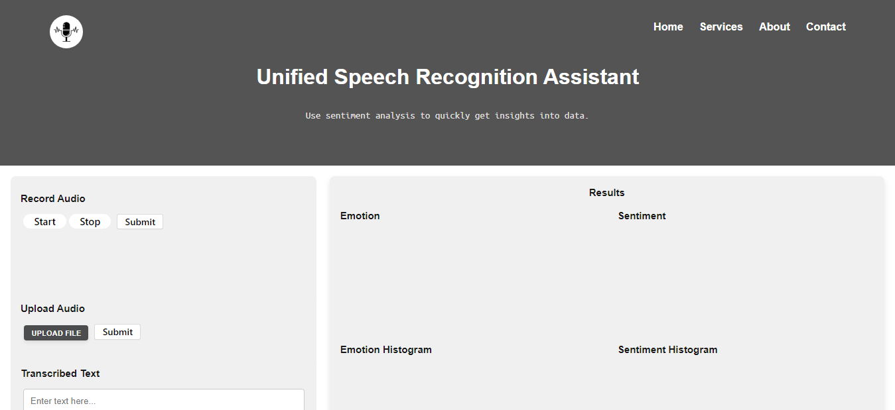
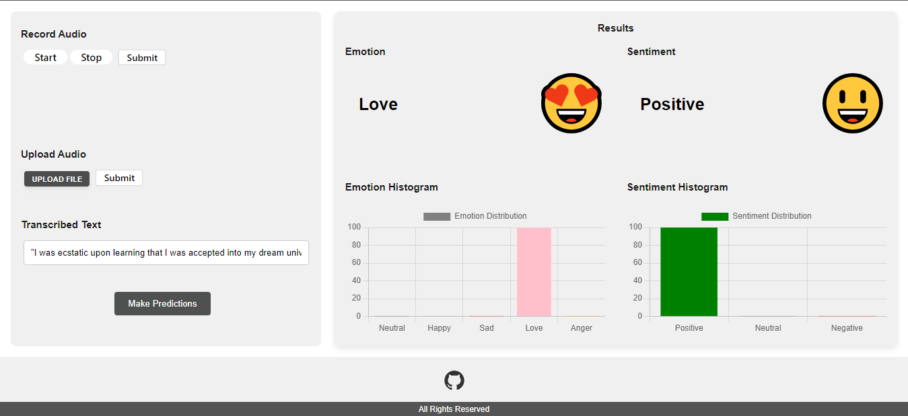
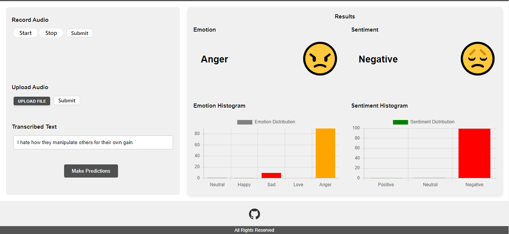

# Unified Speech Recognition Assistant

Unified Speech Recognition Assistant integrates advanced natural language processing (NLP) features with speech-to-text transcription and real-time emotion detection capabilities. This project utilizes a dataset scraped from Twitter, employing feature engineering and selection techniques to enhance performance. The machine learning model, built on BiLSTM using TensorFlow and Keras, achieves an accuracy of 80%. Complementing this functionality, a Flask-based web application displays detected emotions with corresponding emojis and a histogram illustrating emotion distribution.

## Getting Started

Follow these steps to set up and run the project locally:

### Prerequisites

- Python 3.12 installed
- Visual Studio Code with Python extension installed

### Installation Steps

1. **Download Project:**
   - Download the project repository from GitHub as a zip file.

2. **Extract Zip File:**
   - Extract the downloaded zip file to a preferred location on your machine.

3. **Open VS Code:**
   - Open VS Code.
   - Use the "Open Folder" option to open the extracted project folder.

4. **Open Terminal:**
   - Open a new terminal window in VS Code (PowerShell terminal).

5. **Create Virtual Environment:**
   - Navigate to the project folder in the terminal.
   - Create a virtual environment by running:
     ```
     python -m venv env
     ```
   - This command creates the virtual environment for the project.

6. **Activate Virtual Environment:**
   - Activate the virtual environment by running:
     ```
     .\env\Scripts\Activate.ps1
     ```
   - This command activates the virtual environment for the project.

7. **Install Dependencies:**
   - While in the activated virtual environment, install project dependencies by running:
     ```
     pip install -r requirements.txt
     ```

8. **Launch the Project:**
   - Start the project by running:
     ```
     python app.py
     ```
   - This command launches the Unified Speech Recognition Assistant.

9. **Access the Application:**
   - Once the server is running, open a web browser.
   - Press Ctrl and click on the provided server link to visit the application.





## Contributing

Contributions to this project are welcome. Please follow the standard guidelines for contributing.

## License

This project is licensed under the [MIT License](LICENSE).
